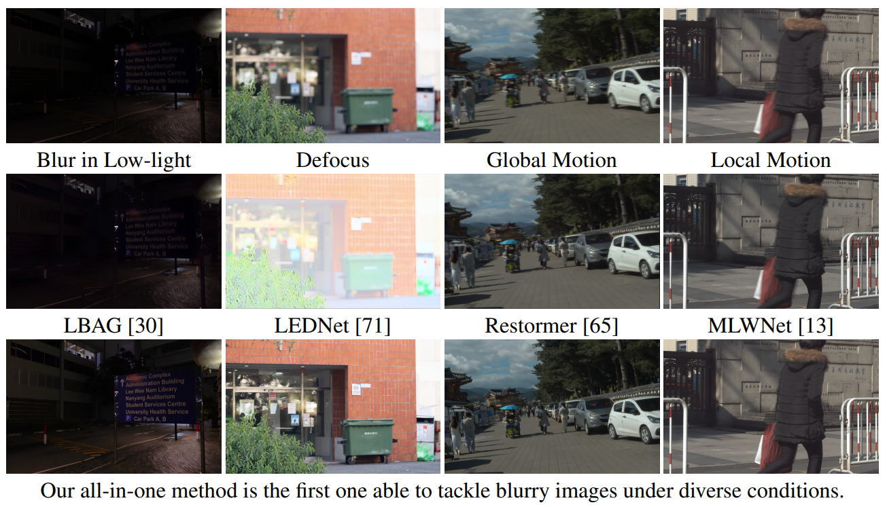
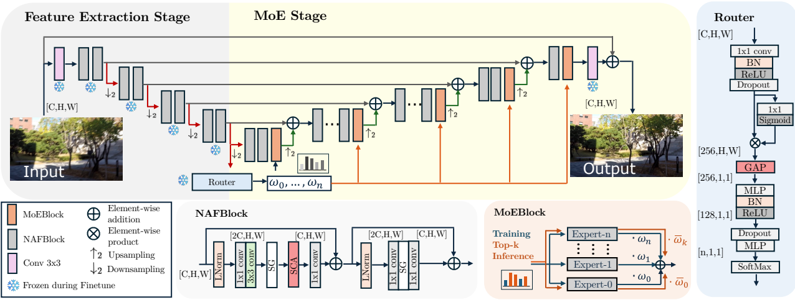

# Towards Unified Image Deblurring using a Mixture-of-Experts Decoder
[](https://huggingface.co/spaces/Cidaut/DeMoE)
[](https://arxiv.org/abs/2508.06228)


**[Daniel Feijoo](https://scholar.google.com/citations?hl=en&user=hqbPn4YAAAAJ), [Paula Garrido-Mellado](https://scholar.google.com/citations?user=YXE2fY4AAAAJ&hl=en&oi=ao), [Jaesung Rim](https://scholar.google.com/citations?user=Bsvwoq8m0e8C&hl=en&oi=ao), [Alvaro Garcia](https://scholar.google.com/citations?hl=en&user=c6SJPnMAAAAJ), [Marcos V. Conde](https://scholar.google.com/citations?user=NtB1kjYAAAAJ&hl=en)** (CIDAUT AI, POSTECH and University of Wuerzburg)

**TLDR.** We present the first all-in-one deblurring method, enabled by the strong similarity we observed in the network weights for handling different blur degradations.

> This is the official implementation of DeMoE. Code will be updated upon acceptance.

<details>
<summary> <b> ABSTRACT </b> </summary>
Image deblurring, removing blurring artifacts from images, is a fundamental task in computational photography and low-level computer vision. Existing approaches focus on specialized solutions tailored to particular blur types, thus, these solutions lack generalization. This limitation in current methods implies requiring multiple models to cover several blur types, which is not practical in many real scenarios. In this paper, we introduce the first all-in-one deblurring method capable of efficiently restoring images affected by diverse blur degradations, including global motion, local motion, blur in low-light conditions, and defocus blur. We propose a mixture-of-experts (MoE) decoding module, which dynamically routes image features based on the recognized blur degradation, enabling precise and efficient restoration in an end-to-end manner. Our unified approach not only achieves performance comparable to dedicated task-specific models, but also shows promising generalization to unseen blur scenarios, particularly when leveraging appropriate expert selection.
</details>



## Network Architecture



## Dependencies and Installation

- Python == 3.10.12
- PyTorch == 2.5.1
- CUDA == 12.4
- Other required packages in `requirements.txt`

```
# git clone this repository
git clone https://github.com/cidautai/DeMoE.git
cd DeMoE

# create python environment
python3 -m venv venv_DeMoE
source venv_DeMoE/bin/activate

# install python dependencies
pip install -r requirements.txt
```

## Inference

First download the weights of the model from [OneDrive](https://cidautes-my.sharepoint.com/:u:/g/personal/alvgar_cidaut_es/EV2qVhGiwahKmnaTEQriziwBGAYB4DO89yFOmg5iF0aqag?e=znBKH1) and put them in `models/`. Then you can restore a whole set of images in a folder by running: 

```sh inference.sh```

Restored images will be saved in `./images/results`.

This will run a torchrun command with the `inference.py` script. If you need to add any other configuration to the script --such as the input folder or the checkpoints loaded--, modify directly the `inference.sh`. 

> For manually selecting the deblurring task, add the -t argument in the script before running, otherwise the model will select the best expert to be used.

## Citation and Acknowledgement

```
@article{feijoo2025towards,
  title={Towards Unified Image Deblurring using a Mixture-of-Experts Decoder},
  author={Feijoo, Daniel and Garrido-Mellado, Paula and Rim, Jaesung and Garcia, Alvaro and Conde, Marcos V},
  journal={arXiv preprint arXiv:2508.06228},
  year={2025}
}
```

## Contact

For any questions, please contact danfei@cidaut.es and marcos.conde@uni-wuerzburg.de
